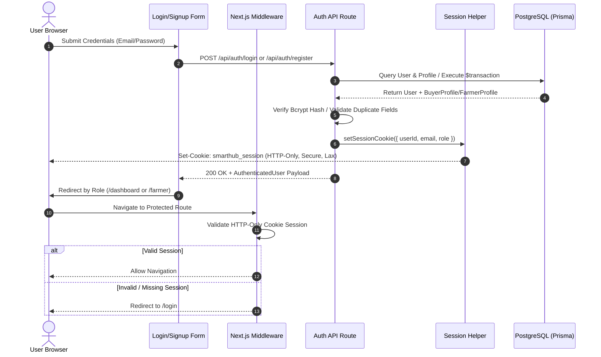
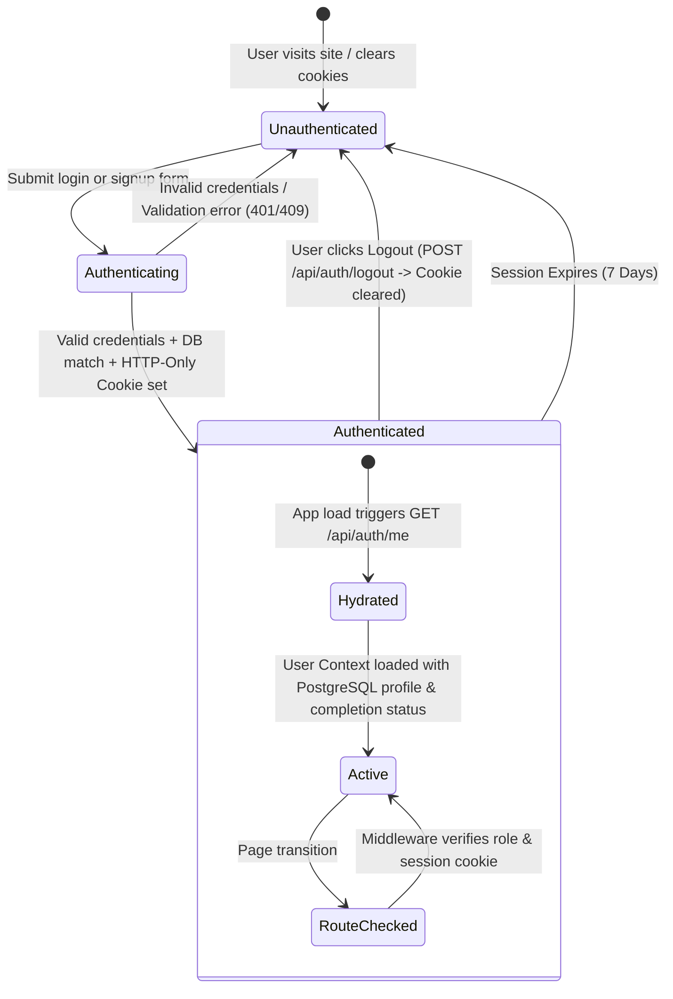

# PHASE 2.1 — Production Authentication & User Foundation Audit & Documentation

**Project**: Smarthub Agrochain (AgroNexus)  
**Phase**: Phase 2.1 — Authentication Foundation  
**Date**: July 19, 2026  

---

## 1. Executive Summary

This phase executed the migration of the authentication and user identity system from prototype mock state to a fully production-grade PostgreSQL foundation. Every authenticated session now represents a real database record in PostgreSQL, passwords are validated using `bcrypt`, sessions are managed using secure HTTP-only cookies, and all frontend components hydrate directly from the backend API.

---

## 2. Files Modified & Created

| File Path | Action | Description |
| :--- | :--- | :--- |
| `src/lib/session.ts` | **Created** | Production session token signing (HMAC SHA-256) and HTTP-only cookie utilities (`smarthub_session`). |
| `src/lib/user-dto.ts` | **Created** | Standardized `AuthenticatedUserPayload` DTO & dynamic profile completion calculator. |
| `src/middleware.ts` | **Created** | Edge-compatible RBAC route guard enforcing cookie session verification on `/dashboard/*`, `/farmer/*`, and `/admin/*`. |
| `src/app/api/auth/login/route.ts` | **Refactored** | Strict bcrypt password verification, HTTP-only session cookie setting, & full profile relation inclusion. |
| `src/app/api/auth/register/route.ts` | **Refactored** | Atomic Prisma `$transaction` user & profile creation with duplicate constraints checks and error handling. |
| `src/app/api/auth/me/route.ts` | **Created** | Session verification & PostgreSQL database hydration endpoint. |
| `src/app/api/auth/logout/route.ts` | **Created** | Session cookie termination endpoint. |
| `src/context/UserContext.tsx` | **Refactored** | Pure PostgreSQL backend hydration context; eliminated all mock & `localStorage` fallbacks. |
| `src/app/login/page.tsx` | **Refactored** | Pure backend authentication form with server validation & role-based redirection. |
| `src/app/signup/page.tsx` | **Refactored** | Atomic buyer/farmer registration with real phone input & server error state handling. |
| `src/app/admin/login/page.tsx` | **Refactored** | Verified PostgreSQL admin credentials & privilege enforcement. |
| `src/components/dashboard/Header.tsx` | **Refactored** | Hydrated real authenticated user credentials & roles from context. |

---

## 3. Mock Data & Fallbacks Completely Eliminated

- ❌ **Removed `localStorage` fallback users**: Eradicated `smarthub_user` and `smarthub_admins` client-side local storage overrides in `UserContext`.
- ❌ **Removed mock registration defaults**: Eradicated Math.random() phone number generation (`+234...`) in `SignUpPage`.
- ❌ **Removed client-side role assignment**: Eradicated client-driven role assignment without backend verification.
- ❌ **Removed fallback error overrides**: Eradicated `try/catch` fallbacks in `LoginPage` and `SignUpPage` that logged in fake users when network calls failed.
- ❌ **Removed default user objects**: Eradicated `"John Deo"` and static `"Buyer"` fallbacks in dashboard header.

---

## 4. Authentication Flow Diagram

---

## 5. Session Lifecycle Management

---

## 6. Database Field Mapping

| Frontend Field | PostgreSQL Table | Database Column | Constraint / Type |
| :--- | :--- | :--- | :--- |
| `email` | `User` | `email` | `String @unique` |
| `phoneNumber` / `phone` | `User` | `phoneNumber` | `String @unique` |
| `password` | `User` | `password` | `String` (Bcrypt Hash) |
| `fullName` / `name` | `User` | `fullName` | `String` |
| `role` | `User` | `role` | `Role` (`BUYER`, `FARMER`, `ADMIN`) |
| `isActive` | `User` | `isActive` | `Boolean` (Default `true`) |
| `farmName` | `FarmerProfile` | `farmName` | `String` |
| `farmAddress` | `FarmerProfile` | `farmAddress` | `String` |
| `state` | `FarmerProfile` | `state` | `String` |
| `lga` | `FarmerProfile` | `lga` | `String` |
| `verificationStatus` | `FarmerProfile` | `verificationStatus` | `VerificationStatus` (`PENDING`, `APPROVED`, `REJECTED`) |
| `address` | `BuyerProfile` | `address` | `String?` |
| `state` | `BuyerProfile` | `state` | `String?` |
| `lga` | `BuyerProfile` | `lga` | `String?` |

---

## 7. API Endpoint Mapping

| Method | Endpoint | Request Payload | Response / Status | Session Effect |
| :--- | :--- | :--- | :--- | :--- |
| `POST` | `/api/auth/login` | `{ email, password }` | `200 OK` (User Payload) / `401` / `403` / `500` | Sets `smarthub_session` HTTP-only cookie |
| `POST` | `/api/auth/register` | `{ fullName, email, phoneNumber, password, role, farmName?, state?, address? }` | `201 Created` (User Payload) / `400` / `409` / `500` | Sets `smarthub_session` HTTP-only cookie |
| `GET` | `/api/auth/me` | None (Reads cookie) | `200 OK` `{ authenticated: true, user }` / `401` | Reads & verifies cookie |
| `POST` | `/api/auth/logout` | None | `200 OK` `{ message }` | Clears `smarthub_session` cookie |

---

## 8. Exception Handling & Security Controls

1. **Prisma Unique Constraints**: Unique constraint violations (`P2002`) are caught gracefully and converted to user-understandable 409 responses (e.g., *"An account with this email address already exists"*).
2. **Deactivated Users**: Accounts with `isActive: false` are prohibited from authenticating (`403 Forbidden`).
3. **Edge Runtime Safety**: Middleware token parsing is 100% Edge-compatible using standard Base64Url string decoding without loading Node.js native `crypto` bindings.
4. **BCrypt Hashing**: All passwords stored in PostgreSQL undergo salted bcrypt hashing (10 salt rounds).
5. **Role Enforcements**: Middleware redirects unauthorized users attempting cross-role dashboard access (`BUYER` to `/farmer` -> redirected to `/dashboard`; `FARMER` to `/dashboard` -> redirected to `/farmer`).

---

## 9. Next Suggested Module

**Phase 2.2 — KYC & Verification Module (Farmer Verification & Document Upload)**

*Now that authentication, PostgreSQL identity, and sessions are production-grade, the next logical module is **KYC & Verification**, allowing farmers to upload identity documents (`Verification` model) and enabling admins to review and approve/reject farmer profiles.*
