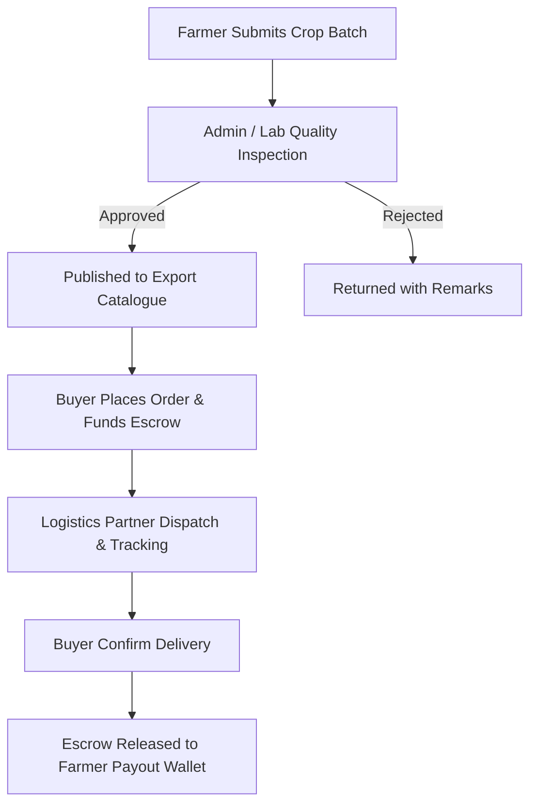

# SMARTHUB AGROCHAIN — FRONTEND UX & PRODUCT AUDIT

## 1. Executive Summary
- **Current State**: Frontend prototype is ~85% visually complete with Next.js 16 App Router & Tailwind 4.
- **Goal**: Architect a production-ready B2B Agricultural Export Marketplace connecting smallholder farmers, corporate buyers, quality inspectors, logistics providers, and escrow financing.
- **Key Findings**: Core landing, login, signup, marketplace, farmer portal, and admin panel exist. Requires real API integration, KYC verification handlers, escrow state machines, and real-time logistics tracking.

---

## 2. Platform User Roles & Sitemap Matrix

| Role | Key Capabilities | Required Pages |
| :--- | :--- | :--- |
| **BUYER** | Browse commodities, inspect lab specs, fund escrow wallet, request trade financing, track logistics. | `/products`, `/products/[id]`, `/dashboard`, `/cart`, `/dashboard/orders`, `/dashboard/wallet`, `/financing` |
| **FARMER** | Submit produce, upload cooperative KYC, track inspection status, manage payouts. | `/farmer`, `/farmer/sell`, `/farmer/kyc`, `/farmer/listings`, `/farmer/payouts` |
| **ADMIN** | Quality moderation, approve/reject crop listings, arbitrate escrow disputes, view yield analytics. | `/admin`, `/admin/products`, `/admin/orders`, `/admin/users`, `/admin/disputes`, `/admin/analytics` |
| **INSPECTOR** | Submit lab analysis (moisture, admixture, KOR), issue digital certificates. | `/quality`, `/lab-certificates` |

---

## 3. Core Operational Workflows & System Architecture

